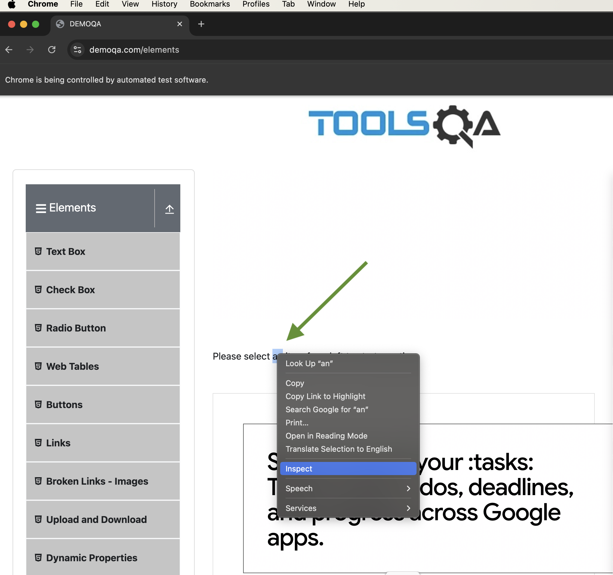
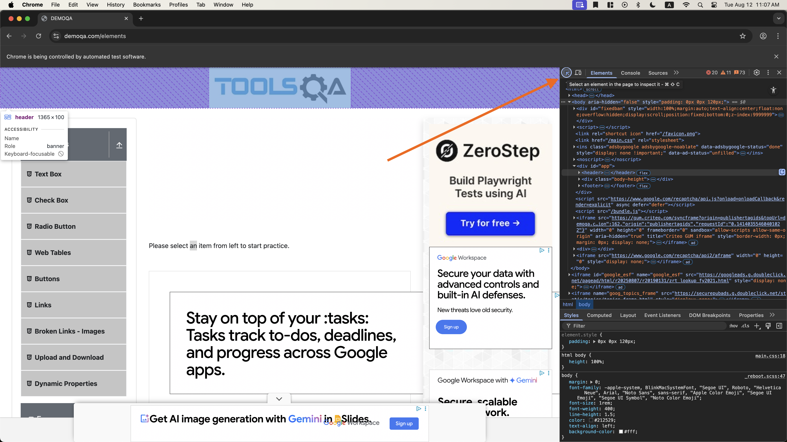
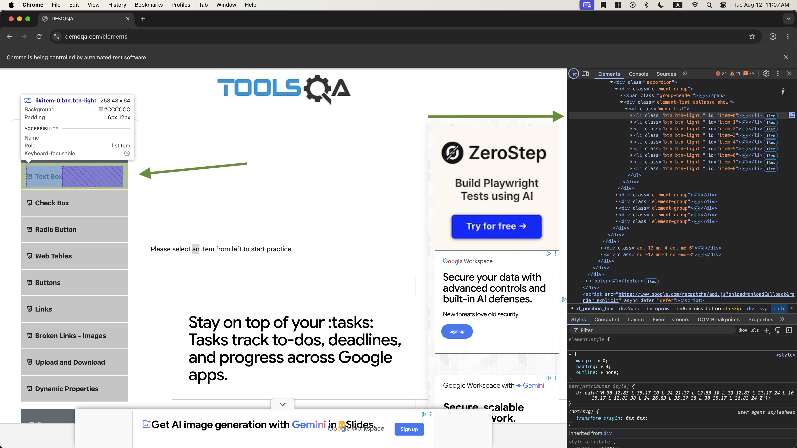

# Web Scraping with Selenium

Welcome to the SICSS Web Scraping Workshop! In this exercise, you'll learn how to use Selenium to automate web browsers and extract data from websites. This repository contains code and instructions you'll need to get started. There are three files in this repository that will be used to scrape data, increasing in order of complexity.

1. `test_selenium.py` - This code is just to ensure that you have everything set up properly. It opens a chrome window and navigates to the UCLA homepage.
2. `practice.py` - A "sandbox" where you can practice on a wonderful website for this exact purpose. It will take us to 
3. `correctional_facilities.py` - A more complex real world example of how to scrape public data from the Bureau of Prisons website.

I recommend using an IDE like Visual Studio Code (VSCode) to write your code. It will make your life much easier. However, if you want to use something more light weight, like Sublime Text, or even a text editor like Notepad++, it will work just fine.

## 1) Install The Following:

1. [Python](https://www.python.org/downloads/)
2. [Git](https://git-scm.com/downloads)
3. [Chrome](https://www.google.com/chrome/)

## 2) Clone this Repository

```bash
git clone https://github.com/jakemanderson/sicss.git
```

## 3) Create & Activate a Virtual Environment

A **virtual environment** keeps the project’s packages separate from the rest of your computer.

```bash
python3 -m venv venv
```

### Activate the virtual environment:

**macOS / Linux**

```bash
source venv/bin/activate
```

Your prompt should now show `(venv)` at the start.

**Windows (PowerShell)**

```powershell
venv\Scripts\Activate.ps1
```

Your prompt should now show `(venv)` at the start.

## 4) Install packages

```bash
pip install selenium webdriver-manager pandas
```

To confirm Selenium is installed:

```bash
pip show selenium
```

You should see something like:

```
Name: selenium
Version: 4.23.1
```


## 5) Test Selenium with Chrome

Use the `test_selenium.py` file to test Selenium with Chrome. 

To run interactively, navigate to /sicss/ and run:

```bash
python
```
You will see three tick marks, indicating you are now in the python interpreter. It will look like:

```python
>>> 
```

Then, copy paste the first part of the script into the interpreter:

```python
from selenium import webdriver
from selenium.webdriver.chrome.service import Service
from selenium.webdriver.chrome.options import Options

options = Options()
service = Service()
driver = webdriver.Chrome(options=options, service=service)
```
You should have a new chrome window open. Now, as you run commands into the python interpreter, you can interact with the chrome window.

```python
driver.get("https://www.ucla.edu")
```

Your browser should load the ucla home page. 

Now, you're ready to proceed to `practice.py` to try some scraping!

## 6) Practice Pro Tips:

To get more info on an element so you know how to select it, use the Chrome DevTools. You can open them by right clicking an element and clicking "Inspect". 



Then, you can see the element's HTML and CSS, and you can hover over the element to see its attributes.

Even more convenient, you can use the hover to select and it will dynamically show you as you hover over different parts of the page!



Once your element is selected, you can see the element's attributes in the right panel. You can use the attributes to select the element in your code. There are many ways to select the element, and we want to use the one that will uniquely identify the element on the page. If you are too broad in your selection, you may select multiple elements, and you will not be able to interact with the one you want.




## 7) Getting Better

As you continue to improve your Selenium scraping skills, I recommend making more advanced and custom functions that are as reusable as possible. Here are some resources:

1. [Selenium Documentation](https://www.selenium.dev/documentation/)
2. [ChatGPT](https://chat.openai.com/)


What's the use of these functions?

```python

def funct1(element, text, delay=0.1):
    for char in text:
        element.send_keys(char)
        time.sleep(random.uniform(0.08, 0.15))

def funct2(driver):
    username = "jbruin@g.ucla.edu"   
    password = "J0hn_W00d3n-Ce3n73R"
    email_input = driver.find_element(By.ID, "email")
    password_input = driver.find_element(By.ID, "password")
    funct1(email_input, username, delay=0.1)
    funct1(password_input, password, delay=0.1)
    driver.find_element(By.ID, "btn-login").click()
```